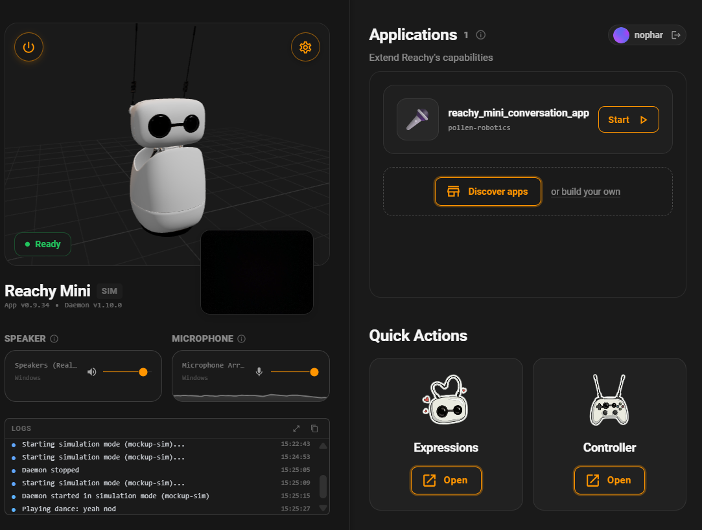
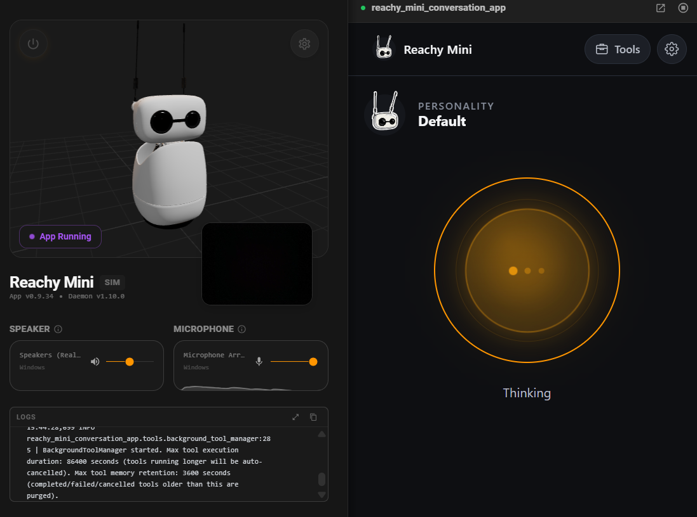
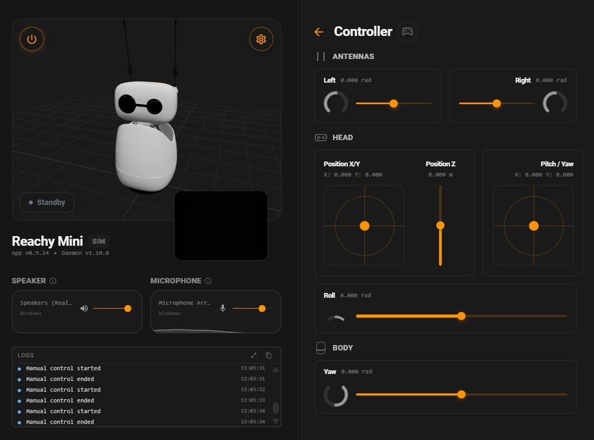
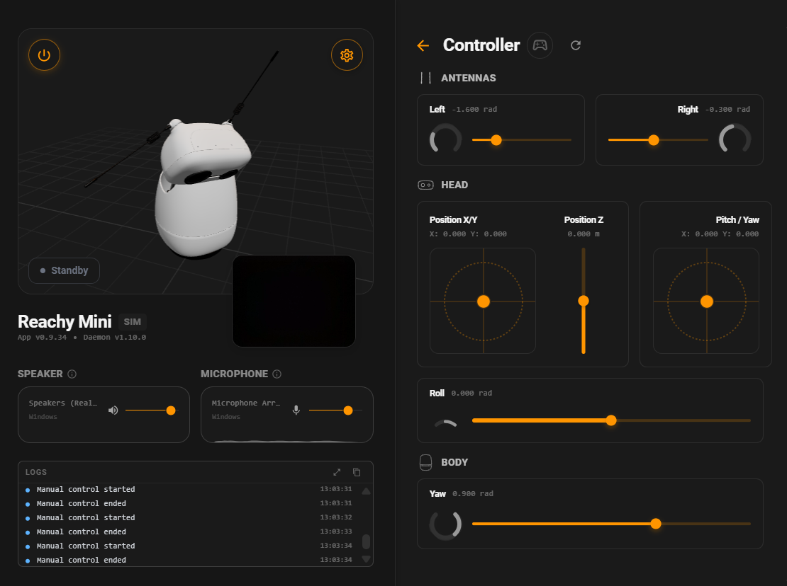
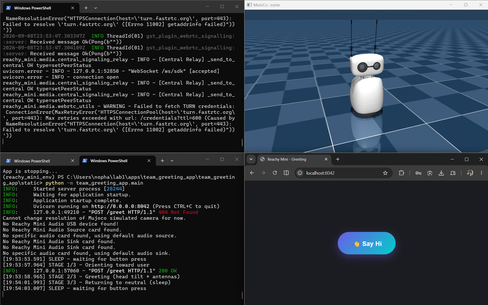
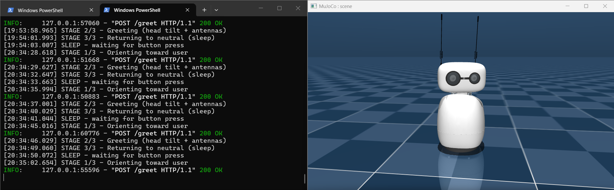
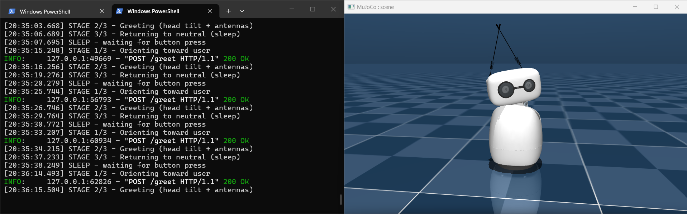
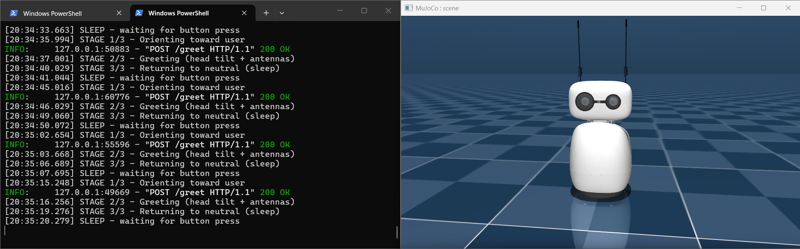

# Lab 1: Introduction to Reachy Mini

### Team Members: Nophar Shalom, Wiam Salih, Bailey Carlson

## 1: Setup Record
| Team Member | Operating System and Architecture  | Reachy Mini Control Version | Installation Issue / Resolution  |
|-------------|------------------------------------|-----------------------------|----------------------------------|
|   Nophar    |            Windows 11              |           v0.9.34           |               N/A                |
|   Bailey    |        macOS 15.7.3, ARM64         |           v0.9.34           |               N/A                |
|   Wiam      |        macOS 15.7.3, ARM64         |           v0.9.34           |               N/A                |

## 2: Reachy Mini in Simulation Mode

## 2.5: Reachy Mini Conversation App Run

## 3: Run App in Simulation Mode

**Application:** `reachy_mini_conversation_app`  
**Interaction tested:** `Simple greeting and conversation, asking for a short dance.`

[▶️ Watch the Reachy conversation demo](Images/reachy-conversation.mp4)

## User Interaction

- **Expected:** `The application expects the user to greet Reachy and engage in a simple conversation.`
- **Observed:** `We greeted Reachy, asked how it felt, and then unexpectedly requested that it dance.`
- **Robot behaviour:** `Reachy responded quickly and appropriately throughout the interaction. Despite the unexpected dance request, it successfully executed the action without failing or requiring additional clarification.`
- **Differences:** `The only unexpected response occurred when we greeted the robot as "Reachy." It added the statement "Reachy works for me too" after the greeting, which was somewhat confusing because the meaning of the statement was unclear in the context of the interaction.`

## Simulator Strengths

- `The Reachy Mini responded quickly and used natural-looking movements and expressions, making the interaction feel smooth and intuitive. The simulator also provided access to the robot's camera, speaker, and microphone, allowing it to respond to environmental and conversational inputs in a way that approximated an interactive HRI experience.`

## Simulator Limitations

- **Physical/environmental interaction:** `The simulator does not support free physical movement through the environment, limiting the evaluation of how Reachy would navigate physical space or interact with objects and people around it.`
- **Interaction memory/context:** `The simulator appeared limited in maintaining conversational or interaction context. For example, we prompted the robot to look left and move its antennas. When we subsequently said "look again," it returned an error indicating that it did not understand what we meant. This limits the ability to evaluate how effectively the robot maintains context during an ongoing HRI interaction.`

## 3.3 Teleoperation in Simulation mode
| neutral | two expressive channels |
|---|---|
|  |  |

# Creating & Running App

## Environment Details

- **Operating System:** Microsoft Windows 11 Home
- **Architecture:** x64-based PC
- **Python version:** 3.12.14
- **Reachy Mini version:** 1.10.0
- **MuJoCo version:** 3.3.0

### For App Launch Instructions see the [team_greeting_app README](apps/team_greeting_app/README.md) for details.

## Validation: Screen Recording

**Recording:** 

**What it shows:**
- Following the 3 cycles, the simulated robot performed as expected. When the app was quit in the second stage, the robot froze mid animation to show that no control loop remains running. When quit in the first and last stages, the robot returns to neutral, as expected.

| **Stage 1/3: Orient** | **Stage 2/3: Greet** | **Stage 3/3: Neutral** |
|:---:|:---:|:---:|
|  |  |  |
| Orients toward the user | Head tilt + antenna movement | Returns to neutral / sleep |

## Parameter Variations & Observed Effects

**Parameter 1:** `ANTENNA_AMPLITUDE_DEG`

| Value tried | Observed effect on timing | Observed effect on legibility |
|---|---|---|
|30.0 |Moves fairly fast back and forth. |Large range of motion makes movement highly visible. |
|15.0 |Moves more slowly and takes longer to complete the gesture |Smaller range of motion makes the orientation change less noticeable. |

**Parameter 2:** `TILT_ROLL_DEG`

| Value tried | Observed effect on timing | Observed effect on legibility |
|---|---|---|
|15.0 |Smoothly and naturally moves without seeming rushed. |Slight head movement gesture, could be more legible. |
|25.0 |Takes slightly longer to settle into the tilted position therefore creating more pronounced motion| More noticeable head tilt, making greeting easier to recognize, but begins to feel exaggerated. |

---

## Final Candidate Values & Explanation

| Parameter | Final value | Unit |
|---|---|---|
| ORIENT_YAW_DEG |25 | degrees |
| ORIENT_DURATION_S |1.0 | seconds |
| TILT_ROLL_DEG |15.0 | degrees |
| GREETING_DURATION_S |3.0 | seconds |
| ANTENNA_AMPLITUDE_DEG |30.0 | degrees |
| LOOP_INTERVAL_S |0.02 | seconds |
| NEUTRAL_DURATION_S |1.0 | seconds |

**Why these values:**
This combination balances the movement range, speed, and overall timing so that the greeting is clear without feeling exaggerated or sluggish. the 25 degree yaw provides enough orientation change for the robot to visibly turn to the user, while the 1 second duration gives it a natural pace. The 15 degree roll adds the subtle head gesture that supports the greeting without distracting from the main orientation movement. The 30 degree antenna amplitude gives the user enough time to perceive the complete interaction before the robot returns to neutral. All together, the values create a greeting that is noticeable and expressive while still feeling controlled and natural.

**Anticipated risks transferring to the physical robot:**
- Torque and speed limits: The simulation may not fully model the physical robot's motor torque or speed constraints, so the same movements could behave differently on the hardware.
- Mechanical backlash and vibration: Repeated antenna oscillations may introduce small vibrations or positional inaccuracies that are not visible in simulation.
- Real-time scheduling: Timing could vary slightly due to CPU load or real-time scheduling, potentially affecting the consistency of the 0.02-second loop interval.
- Neutral pose calibration: The physical robot's actual neutral position should be verified to ensure that yaw = 0° and roll = 0° correspond to the intended neutral posture.
- Abrupt stopping: The robot should avoid abruptly stopping a movement, particularly during the antenna oscillation, since this could cause mechanical stress or an unnatural motion.
- Combined motion effects: The interaction of yaw, roll, and antenna movements may produce more momentum or vibration together than when tested individually.

# Testing / Observing / Reflecting
Research Question: Does the Reach mini conversation app correctly execute follow up voice commands when the command relies on context from a prior instruction, rather than restating the action explicitly?
Independent Variable: The distance between the commands given to Reachy.
Dependent Variable: Whether the robot correctly executes the requested action (pass/fail) and the type of response it gives.

Test Case Table
| # | Condition | Expected | Observed | Evidence   |         Result        |
|---|-----------|----------|----------|----------|---------- |------------ |
| 1 | Baseline |           |          |          | Timestamp | [Pass/Fail] |
| 2 | Moderate Challenge|  |          |          | Timestamp | [Pass/Fail] |
| 3 | Boundary Case |      |          |          | Timestamp | [Pass/Fail] |

Failure Reflection
First Divergence point:
Classify source of failure:
Evidence vs Inference:
Migitations:
Limitations & Follow up test:
